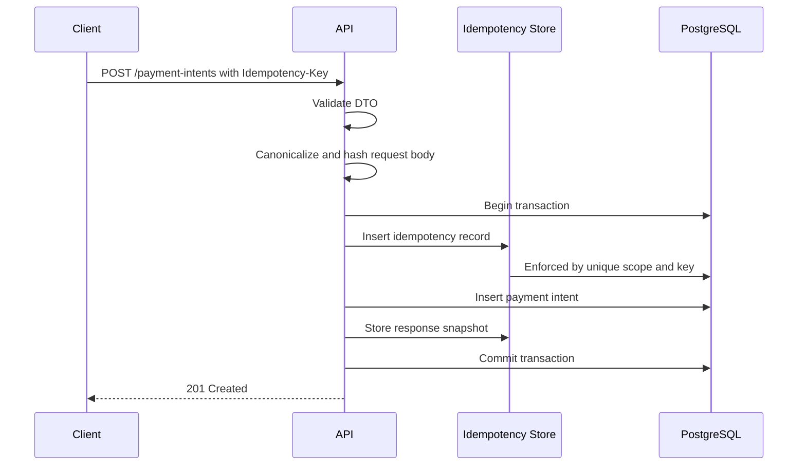
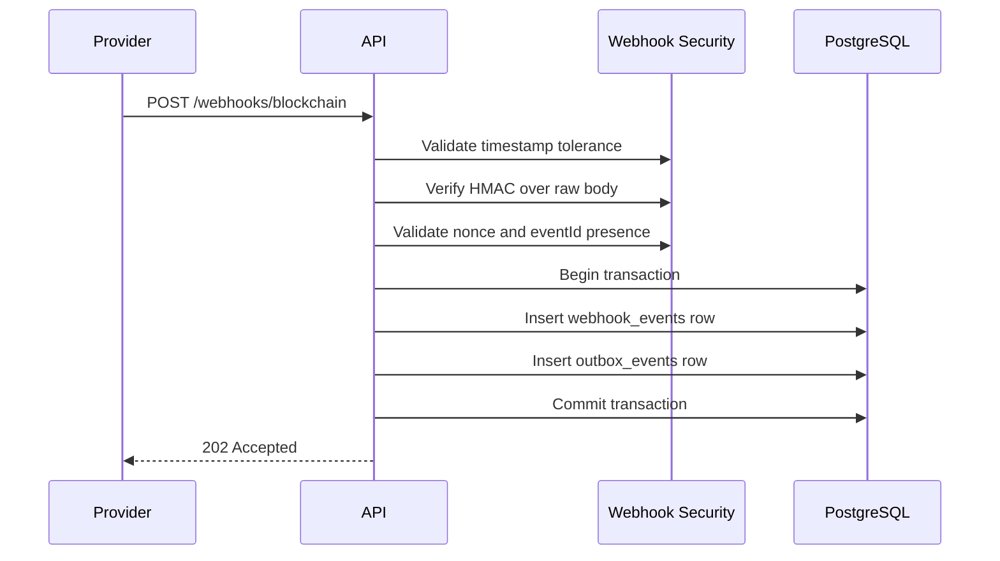
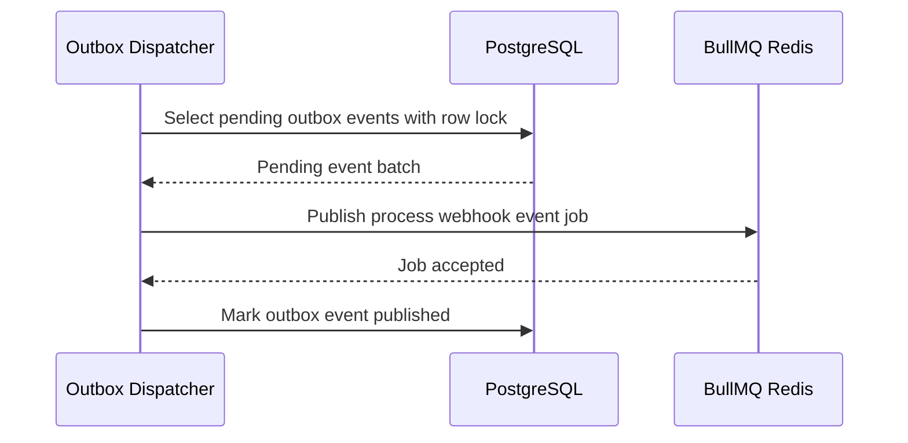
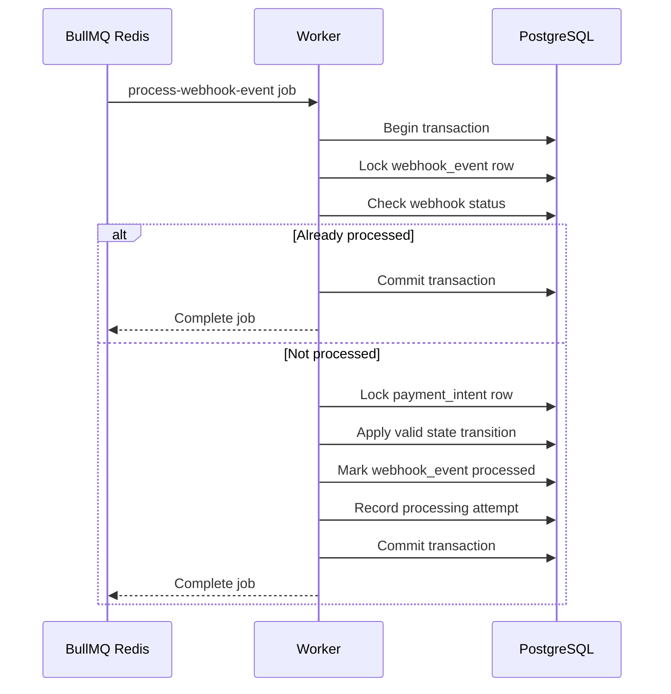
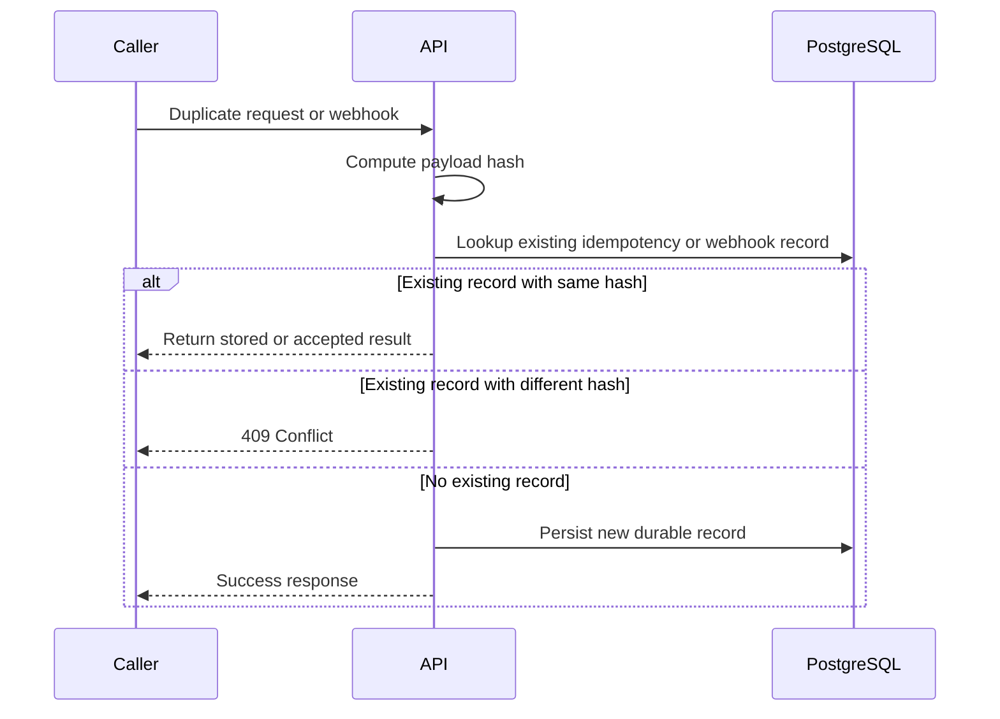

# transaction-event-gateway Architecture

## Metadata

| Field | Value |
| --- | --- |
| Title | transaction-event-gateway Architecture |
| Status | Current MVP architecture |
| Scope | MVP backend service |
| Stack | TypeScript, Node.js, NestJS, TypeORM, PostgreSQL, Redis, BullMQ, Docker Compose, Jest, Supertest |
| Last updated | 2026-06-22 |

## Assumptions

- The service owns payment intent state and is the authoritative system for local payment processing status.
- External blockchain or payment provider events are represented by a mocked webhook provider.
- PostgreSQL is the durable source of truth for business state, idempotency, webhook inbox records, and outbox records.
- Redis is used for BullMQ and optional short-lived operational caches only.
- Correctness must not depend on Redis TTLs, in-memory locks, or queue uniqueness alone.
- Payment intent creation normally happens before a corresponding external confirmation event arrives.
- Webhook payloads may be duplicated, retried, delayed, or delivered out of order.
- The MVP runs as separate API and worker processes from the same codebase.

## Non-Goals

- No real blockchain node integration.
- No private key, signing key, wallet custody, or treasury handling.
- No real funds movement.
- No admin UI in the MVP.
- No dependency on Redis for correctness.
- No multi-region active-active deployment model in the MVP.
- No provider-specific blockchain semantics beyond generic transaction events.

## Short Project Description

`transaction-event-gateway` is a backend service for creating payment intents and processing external payment or blockchain webhook events. Clients create payment intents through a REST API using an `Idempotency-Key` header to protect against duplicate submissions. External providers submit signed webhook events that are validated, replay-protected, persisted in PostgreSQL, and processed asynchronously through BullMQ. The service uses PostgreSQL constraints, transactions, and row locks to enforce correctness under retries and concurrency. Redis powers background job execution, but durable state and idempotency decisions remain in PostgreSQL. The MVP focuses on reliability patterns: idempotency, webhook security, transactional boundaries, queue retries, failure handling, and observable operations.

## Main Use Cases

- Create a payment intent idempotently.
- Return the same result for repeated create requests with the same idempotency key and same payload.
- Reject repeated create requests with the same idempotency key and a different payload.
- Accept a valid signed webhook event.
- Reject webhook events with invalid signatures, stale timestamps, or replayed identifiers.
- Persist accepted webhook events before asynchronous processing.
- Publish durable webhook processing work to BullMQ.
- Process webhook jobs idempotently and update payment intent state.
- Retry failed jobs without duplicate side effects.
- Support manual retry for failed webhook processing.

## High-Level Architecture

```text
Client
  -> API: POST /payment-intents
  -> PostgreSQL transaction
  -> payment_intents + idempotency_records

Webhook Provider
  -> API: POST /webhooks/blockchain
  -> HMAC validation + replay checks
  -> PostgreSQL transaction
  -> webhook_events inbox + outbox_events

Outbox Dispatcher
  -> reads pending outbox_events
  -> publishes BullMQ jobs through Redis
  -> marks outbox events published

Worker
  -> consumes BullMQ jobs
  -> loads durable webhook_event by ID
  -> PostgreSQL transaction
  -> updates payment_intents and webhook_events idempotently
```

Key components:

- **API process**: handles REST requests, validation, idempotency checks, webhook verification, and durable writes.
- **Worker process**: handles BullMQ jobs and applies webhook events to payment intent state.
- **Outbox dispatcher**: bridges committed database state to BullMQ publication.
- **PostgreSQL**: stores all authoritative business and processing state.
- **Redis**: backs BullMQ and optional operational caches.

## Sequence Flows

### Create Payment Intent



### Accept Webhook



### Outbox Dispatch



### Worker Processing



### Duplicate Request and Webhook Paths



## NestJS Module Structure

```text
src/
  app.module.ts
  config/
    config.module.ts
    env.validation.ts
  database/
    database.module.ts
    migrations/
  common/
    errors/
    logging/
    validation/
    request-context/
  health/
    health.controller.ts
    health.service.ts
  payment-intents/
    payment-intents.module.ts
    payment-intents.controller.ts
    payment-intents.service.ts
    payment-intent.entity.ts
    idempotency-record.entity.ts
    dto/
  webhooks/
    webhooks.module.ts
    webhooks.controller.ts
    webhook-security.service.ts
    webhook-events.service.ts
    webhook-event.entity.ts
    dto/
  outbox/
    outbox.module.ts
    outbox.entity.ts
    outbox-dispatcher.service.ts
  processing/
    processing.module.ts
    queues.module.ts
    webhook-events.processor.ts
    job-publisher.service.ts
    manual-retry.controller.ts
    webhook-processing-attempt.entity.ts
  observability/
    metrics.module.ts
    logger.module.ts
```

Module responsibilities:

- Controllers validate transport-level inputs and delegate to services.
- Application services own transaction boundaries.
- Domain rules remain testable without HTTP or BullMQ.
- Persistence entities model durable state and constraints.
- Queue processors load durable records by ID instead of trusting copied job payload data.

## Domain Model and State Machines

### Payment Intent

Core fields:

- `id`
- `status`
- `amount`
- `asset`
- `destination`
- `reference`
- `clientRequestId`
- `metadata`
- `confirmedTxHash`
- `failureReason`
- `expiresAt`
- `createdAt`
- `updatedAt`

Payment intent states:

```text
CREATED
PROCESSING
CONFIRMED
FAILED
EXPIRED
```

Valid transitions:

| From | To | Trigger |
| --- | --- | --- |
| CREATED | PROCESSING | Accepted matching external transaction event |
| CREATED | EXPIRED | Expiration process |
| PROCESSING | CONFIRMED | Confirmed external transaction event |
| PROCESSING | FAILED | Failed or rejected external transaction event |
| PROCESSING | EXPIRED | Expiration process |

Terminal states:

- `CONFIRMED`
- `FAILED`
- `EXPIRED`

Invalid transitions:

- Any terminal state to any other state.
- `CONFIRMED` to `FAILED`, unless a future explicit `REVERTED` domain state is introduced.
- `FAILED` to `CONFIRMED`.
- `EXPIRED` to `PROCESSING` or `CONFIRMED`.
- Any state change caused by a webhook event that does not match the payment intent amount, asset, or expected reference.

### Webhook Event

Core fields:

- `id`
- `provider`
- `externalEventId`
- `nonce`
- `eventType`
- `paymentIntentId`
- `txHash`
- `payload`
- `payloadHash`
- `status`
- `receivedAt`
- `processedAt`

Webhook event states:

```text
RECEIVED
QUEUED
PROCESSING
PROCESSED
FAILED
REJECTED
```

Valid transitions:

| From | To | Trigger |
| --- | --- | --- |
| RECEIVED | QUEUED | Outbox job published |
| QUEUED | PROCESSING | Worker starts job |
| PROCESSING | PROCESSED | Worker commits successful processing |
| PROCESSING | FAILED | Worker exhausts or records failed processing |
| FAILED | QUEUED | Manual retry |
| RECEIVED | REJECTED | Accepted durable record is later determined unusable |

Terminal states:

- `PROCESSED`
- `REJECTED`

`FAILED` is not terminal because manual retry is allowed.

## PostgreSQL Schema

### `payment_intents`

```text
id uuid primary key
status payment_intent_status not null
amount numeric(36, 18) not null
asset varchar(32) not null
destination varchar(255) not null
reference varchar(255) null
client_request_id varchar(255) null
metadata jsonb not null default '{}'
confirmed_tx_hash varchar(255) null
failure_reason text null
expires_at timestamptz null
created_at timestamptz not null
updated_at timestamptz not null
```

Indexes and constraints:

```text
primary key (id)
index payment_intents_status_idx (status)
index payment_intents_created_at_idx (created_at)
index payment_intents_client_request_id_idx (client_request_id)
index payment_intents_reference_idx (reference)
unique payment_intents_confirmed_tx_hash_uniq (confirmed_tx_hash) where confirmed_tx_hash is not null
check amount > 0
```

Constraint rationale:

- Primary key gives stable durable identity.
- Status index supports operational queries and expiration scans.
- Client request and reference indexes support correlation with upstream systems.
- Unique confirmed transaction hash prevents one external transaction from confirming multiple intents.
- Positive amount check rejects invalid persisted state.

### `idempotency_records`

```text
id uuid primary key
scope varchar(128) not null
idempotency_key varchar(255) not null
request_hash varchar(128) not null
response_status integer null
response_body jsonb null
resource_type varchar(128) null
resource_id uuid null
created_at timestamptz not null
expires_at timestamptz null
```

Indexes and constraints:

```text
unique idempotency_records_scope_key_uniq (scope, idempotency_key)
index idempotency_records_expires_at_idx (expires_at)
index idempotency_records_resource_idx (resource_type, resource_id)
```

Constraint rationale:

- Unique `(scope, idempotency_key)` serializes concurrent duplicate create requests.
- `request_hash` allows same-key same-payload replay and same-key different-payload conflict detection.
- Stored response fields allow deterministic replay of successful requests.
- Expiration index supports cleanup without affecting correctness for active records.

### `webhook_events`

```text
id uuid primary key
provider varchar(128) not null
external_event_id varchar(255) not null
nonce varchar(255) null
event_type varchar(128) not null
payment_intent_id uuid null
tx_hash varchar(255) null
payload jsonb not null
payload_hash varchar(128) not null
status webhook_event_status not null
failure_reason text null
received_at timestamptz not null
processed_at timestamptz null
created_at timestamptz not null
updated_at timestamptz not null
```

Indexes and constraints:

```text
unique webhook_events_provider_external_event_id_uniq (provider, external_event_id)
unique webhook_events_provider_nonce_uniq (provider, nonce) where nonce is not null
index webhook_events_payment_intent_id_idx (payment_intent_id)
index webhook_events_status_received_at_idx (status, received_at)
index webhook_events_tx_hash_idx (tx_hash)
index webhook_events_payload_hash_idx (payload_hash)
```

Constraint rationale:

- Unique provider event ID makes webhook acceptance idempotent.
- Unique provider nonce prevents nonce replay when the provider supplies a nonce.
- Status and received time index supports dispatch, monitoring, and retry operations.
- Transaction hash index supports reconciliation and duplicate transaction detection.

### `outbox_events`

```text
id uuid primary key
type varchar(128) not null
aggregate_type varchar(128) not null
aggregate_id uuid not null
payload jsonb not null
status outbox_event_status not null
attempts integer not null default 0
next_attempt_at timestamptz null
last_error text null
created_at timestamptz not null
published_at timestamptz null
updated_at timestamptz not null
```

Indexes and constraints:

```text
index outbox_events_status_next_attempt_idx (status, next_attempt_at)
index outbox_events_aggregate_idx (aggregate_type, aggregate_id)
```

Constraint rationale:

- Pending status index allows efficient dispatcher polling.
- Aggregate index supports tracing an outbox event back to the webhook event.
- Attempts and next attempt fields support bounded retry with backoff.

### `webhook_processing_attempts`

```text
id uuid primary key
webhook_event_id uuid not null
job_id varchar(255) null
status varchar(64) not null
error_message text null
started_at timestamptz not null
finished_at timestamptz null
created_at timestamptz not null
```

Indexes and constraints:

```text
index webhook_processing_attempts_event_idx (webhook_event_id)
index webhook_processing_attempts_status_idx (status)
```

Constraint rationale:

- Attempt records provide auditability and operational debugging.
- Correctness does not rely on this table; it is observability support.

## API Design

### `POST /payment-intents`

Creates a payment intent idempotently.

Required headers:

```http
Idempotency-Key: 01JABCEXAMPLE
Content-Type: application/json
```

Request:

```json
{
  "amount": "125.50",
  "asset": "USDC",
  "destination": "wallet_test_123",
  "reference": "order-1001",
  "clientRequestId": "checkout-1001",
  "metadata": {
    "customerId": "cust_123"
  }
}
```

Response `201 Created`:

```json
{
  "id": "5f70a0c2-7bb5-4545-b181-3fcff9b56b86",
  "status": "CREATED",
  "amount": "125.50",
  "asset": "USDC",
  "destination": "wallet_test_123",
  "reference": "order-1001",
  "clientRequestId": "checkout-1001",
  "createdAt": "2026-06-19T10:00:00.000Z"
}
```

Duplicate response for same key and same payload:

```http
HTTP/1.1 200 OK
Idempotent-Replayed: true
```

Conflict response for same key and different payload:

```json
{
  "error": "IDEMPOTENCY_CONFLICT",
  "message": "The provided Idempotency-Key was already used with a different request payload."
}
```

Error cases:

| Status | Case |
| --- | --- |
| 400 | Missing `Idempotency-Key`, invalid JSON, or DTO validation failure |
| 409 | Same idempotency key with different request body |
| 422 | Unsupported asset, invalid amount, or invalid destination |
| 503 | PostgreSQL unavailable |

### `POST /webhooks/blockchain`

Accepts signed external blockchain or payment events.

Required headers:

```http
X-Webhook-Timestamp: 1781850000
X-Webhook-Nonce: nonce_123
X-Webhook-Signature: v1=3d7a...
Content-Type: application/json
```

Request:

```json
{
  "eventId": "evt_123",
  "type": "transaction.confirmed",
  "paymentIntentId": "5f70a0c2-7bb5-4545-b181-3fcff9b56b86",
  "txHash": "0xtest123",
  "amount": "125.50",
  "asset": "USDC"
}
```

Response `202 Accepted`:

```json
{
  "eventId": "evt_123",
  "status": "ACCEPTED"
}
```

Duplicate identical webhook response:

```json
{
  "eventId": "evt_123",
  "status": "ALREADY_ACCEPTED"
}
```

Error cases:

| Status | Case |
| --- | --- |
| 400 | Missing required headers or invalid payload |
| 401 | Invalid HMAC signature |
| 408 | Timestamp outside configured tolerance |
| 409 | Same provider event ID with a different payload hash |
| 409 | Reused nonce with a different event |
| 503 | PostgreSQL unavailable |

### `POST /webhook-events/{id}/retry`

Manually retries failed webhook processing.

MVP status: optional API surface. The MVP can expose this endpoint after the core worker flow exists.

Request:

```json
{
  "reason": "manual operational retry after transient dependency failure"
}
```

Response `202 Accepted`:

```json
{
  "webhookEventId": "9d55ebac-758c-4a9c-8237-25ad37e78c64",
  "status": "QUEUED"
}
```

## Idempotency Design

### Request Body Canonicalization and Hashing

Request hashing uses a canonical representation of the logical request body:

- Parse JSON into structured data.
- Remove transport-only fields.
- Preserve semantically meaningful fields.
- Sort object keys recursively.
- Normalize numeric strings where the API contract allows it.
- Serialize canonical JSON.
- Hash with SHA-256.

The hash is used to compare logical request equality, not for security.

### Payment Intent Idempotency

Scope:

```text
payment-intents:create
```

Behavior:

- `Idempotency-Key` is required.
- The service computes `request_hash`.
- The service inserts an `idempotency_records` row inside the same transaction as `payment_intents`.
- The database unique constraint on `(scope, idempotency_key)` protects concurrent duplicates.
- The successful response snapshot is stored on the idempotency record before commit.

Same key and same payload:

- Return the stored response.
- Do not create a second payment intent.
- Return `200 OK` or the original status with an explicit replay header. The preferred MVP behavior is `200 OK` with `Idempotent-Replayed: true`.

Same key and different payload:

- Return `409 Conflict`.
- Do not mutate the original payment intent.
- Log a structured warning without sensitive request data.

### Webhook Idempotency

Webhook deduplication keys:

- `provider + external_event_id`
- `provider + nonce`, when nonce is present

Behavior:

- Duplicate event with the same payload hash returns an idempotent accepted response.
- Duplicate event ID with a different payload hash returns `409 Conflict` and is logged as a security anomaly.
- Reused nonce with a different event returns `409 Conflict`.
- Queue publication is not performed directly during webhook acceptance; the accepted event creates an outbox record.

### Worker Idempotency

Worker jobs contain durable IDs only:

```json
{
  "webhookEventId": "9d55ebac-758c-4a9c-8237-25ad37e78c64"
}
```

Rules:

- The worker loads `webhook_events` by ID from PostgreSQL.
- The worker locks the webhook row with a transaction.
- If the event is already `PROCESSED`, the worker exits successfully.
- The worker locks the target payment intent before applying state changes.
- State transitions are guarded by domain rules.
- Duplicate job execution must produce the same final state without repeated effects.

## Webhook Security Design

### HMAC Scheme

Signature input:

```text
signed_payload = timestamp + "." + nonce + "." + raw_request_body
signature = HMAC_SHA256(webhook_secret, signed_payload)
header = X-Webhook-Signature: v1=<hex_signature>
```

Validation order:

1. Require `X-Webhook-Timestamp`, `X-Webhook-Nonce`, and `X-Webhook-Signature`.
2. Validate timestamp format.
3. Reject timestamps outside the configured tolerance window.
4. Compute HMAC using the raw request body bytes.
5. Compare expected and received signatures with timing-safe comparison.
6. Validate payload DTO.
7. Persist webhook inbox row using database uniqueness for replay protection.

### Timestamp Validation

Default tolerance:

```text
5 minutes
```

The service rejects timestamps that are too old or too far in the future. This reduces the replay window but does not replace durable replay protection.

### Nonce and Event ID Replay Protection

- `eventId` is required in the webhook payload.
- `nonce` is required in headers for the MVP provider contract.
- PostgreSQL unique constraints enforce replay protection.
- Redis may optionally be used as a fast short-lived replay cache, but PostgreSQL remains authoritative.

### Timing-Safe Comparison

HMAC comparison must use a timing-safe equality operation. Plain string equality is not acceptable for signature validation.

### Secret Handling

- `WEBHOOK_SECRET` is provided through environment configuration.
- Secrets are validated on application startup.
- Secrets are never committed to source control.
- `.env.example` documents required variables without real values.
- Secret rotation can be added later by accepting multiple active secret versions.

### Data That Must Never Be Logged

- Webhook secret values.
- Full HMAC signatures.
- Raw authorization headers.
- Full request bodies if they may contain sensitive metadata.
- Private keys or seed phrases. These are not part of the system and must remain absent.

Safe logging may include:

- Provider name.
- Event ID.
- Payment intent ID.
- Payload hash.
- Signature version.
- Rejection reason.
- Correlation ID.

## BullMQ Design

### Queues

Primary queue:

```text
webhook-events
```

Optional future queues:

```text
payment-intent-expiration
reconciliation
```

### Job Types

```text
process-webhook-event
```

### Payload Shape

```json
{
  "webhookEventId": "9d55ebac-758c-4a9c-8237-25ad37e78c64"
}
```

The job payload intentionally excludes trusted business state. The worker reloads all authoritative data from PostgreSQL.

### Retries and Backoff

Recommended MVP defaults:

```text
attempts: 5
backoff: exponential
initial delay: 5 seconds
remove completed: bounded by age or count
keep failed: true
```

Retryable examples:

- Transient database connection interruption.
- Worker process crash.
- Temporary lock timeout.

Non-retryable examples:

- Invalid webhook payload that passed transport validation but violates domain rules.
- Unknown payment intent in MVP.
- Amount or asset mismatch.

### Failed Jobs

When processing fails:

- BullMQ records the failed attempt.
- The worker records a processing attempt in PostgreSQL.
- `webhook_events.status` becomes `FAILED` when the failure is durable and actionable.
- The failure reason is stored in a sanitized form.

### Manual Retry

Manual retry should:

- Only allow retry from `FAILED`.
- Create a new outbox event or BullMQ job for the existing durable webhook event.
- Not modify the original webhook payload.
- Record the retry reason and operator context if authentication is later added.

### Worker Transaction Boundary

The worker must perform payment state mutation in one database transaction:

```text
begin
  lock webhook_events row
  exit if already processed
  mark webhook event processing
  lock payment_intents row
  validate event against payment intent
  apply state transition
  mark webhook event processed
  record processing attempt
commit
```

If the worker crashes before commit, PostgreSQL rolls back the state changes and BullMQ retries the job.

## Transaction Boundaries

### Payment Intent Creation

Transaction includes:

- Create idempotency record.
- Create payment intent.
- Store response snapshot on idempotency record.

Reason:

- The idempotency record and created resource must commit atomically.
- A duplicate request must never observe a key without a deterministic outcome.

### Webhook Acceptance

Before transaction:

- Validate timestamp.
- Validate HMAC.
- Validate DTO shape.

Transaction includes:

- Insert webhook inbox row.
- Insert outbox event.

Reason:

- Accepted webhook events must not be lost before processing.
- Queue publication is deferred to the outbox dispatcher to avoid DB and Redis dual-write inconsistency.

### Outbox Dispatch

Transaction or locked operation includes:

- Select pending outbox events.
- Lock selected rows.
- Publish BullMQ job.
- Mark outbox event as `PUBLISHED`.

Operational note:

- Publishing to Redis and marking the row published are still not a single atomic operation across systems.
- The dispatcher must tolerate duplicate publish attempts.
- Worker idempotency makes duplicate jobs safe.

### Worker Processing

Transaction includes:

- Lock webhook event.
- Lock payment intent.
- Apply domain transition.
- Mark webhook event processed or failed.
- Record processing attempt.

Reason:

- Payment state and webhook processing state must move together.
- Row locks prevent concurrent workers from applying the same event twice.

### Race Conditions and Protections

| Race condition | Protection |
| --- | --- |
| Two clients use same idempotency key concurrently | Unique `(scope, idempotency_key)` |
| Same webhook delivered concurrently | Unique `(provider, external_event_id)` |
| Same nonce replayed | Unique `(provider, nonce)` |
| Two workers process same event | Row lock on `webhook_events` |
| Two events update same payment intent | Row lock on `payment_intents` and guarded state transitions |
| DB commit succeeds but Redis publish fails | Transactional outbox |
| Redis publishes duplicate jobs | Worker idempotency |

## Architectural Decisions

### PostgreSQL Is the Source of Truth

All business state, idempotency decisions, webhook acceptance records, and outbox records are stored in PostgreSQL. This keeps correctness independent from ephemeral infrastructure.

### Redis Is Disposable Infrastructure

Redis is required for BullMQ execution but does not hold authoritative business state. If Redis is unavailable, already committed outbox events remain pending and can be published later.

### Use Webhook Inbox and Transactional Outbox

The webhook inbox records every accepted external event. The transactional outbox records work that must be published after the database transaction commits. This prevents accepted webhook events from being lost if queue publication fails.

### Workers Process Durable IDs

BullMQ jobs carry `webhookEventId`, not trusted copied webhook business data. The worker reloads the durable event from PostgreSQL before processing.

### Database Constraints Enforce Correctness

Application logic should be clear, but database constraints provide the final guard against duplicate idempotency keys, duplicate webhook event IDs, duplicate nonces, and duplicate confirmed transaction hashes.

### Controllers Stay Thin

Controllers handle HTTP-level concerns and delegate business work to services. Services own transactions and coordinate repositories, domain rules, and queue or outbox interactions.

## Failure Modes

### Duplicate Request

Same idempotency key and same payload returns the stored result. Same key and different payload returns `409 Conflict`.

### Duplicate Webhook

Same provider event ID and same payload hash returns an idempotent accepted response. Same event ID with a different payload hash returns `409 Conflict` and emits a security warning log.

### Invalid Signature

The webhook is rejected with `401 Unauthorized`. The payload is not persisted and no job is created.

### Stale Timestamp

The webhook is rejected with `408 Request Timeout` or equivalent API error. The payload is not persisted. The event ID may appear again with a fresh timestamp and valid signature.

### Webhook Accepted but Worker Failed

The webhook remains durable in `webhook_events`. The job may retry automatically. If retries are exhausted, the event is marked `FAILED` and can be manually retried.

### DB Commit Succeeded but Queue Publish Failed

The outbox event remains `PENDING` or `FAILED` with retry metadata. The dispatcher retries publication. Duplicate publication is acceptable because the worker is idempotent.

### Worker Crashes Mid-Processing

If the crash happens before transaction commit, PostgreSQL rolls back changes and BullMQ retries. If the crash happens after commit but before BullMQ acknowledges completion, the next attempt exits successfully after seeing the event already processed.

### Redis Unavailable

Payment intent creation can still operate. Webhook acceptance can still persist inbox and outbox records. Queue publication and processing pause until Redis recovers.

### PostgreSQL Unavailable

The API returns `503 Service Unavailable` for operations requiring durable state. The service must not fall back to Redis or memory for correctness.

### Confirmed Event Before Payment Intent Exists

The MVP does not create payment intents from webhooks. The worker marks the webhook event `FAILED` with reason `UNKNOWN_PAYMENT_INTENT`. A future reconciliation flow may keep such events pending for a bounded time.

### Provider Sends Conflicting Payload for Same Event ID

The service returns `409 Conflict`, does not process the new payload, and logs a security anomaly with provider, event ID, existing payload hash, and new payload hash.

## Testing Strategy

### Unit Tests

Unit tests should cover:

- Payment intent state transitions.
- Invalid transition rejection.
- Request canonicalization and hashing.
- HMAC signature generation and validation.
- Timestamp tolerance validation.
- Idempotency conflict decisions.
- Webhook event classification.

### Integration Tests

Integration tests should use real PostgreSQL and cover:

- Payment intent creation.
- Same idempotency key with same payload.
- Same idempotency key with different payload.
- Concurrent duplicate payment intent requests.
- Webhook acceptance with valid signature.
- Duplicate webhook acceptance.
- Conflicting webhook payload detection.
- Transaction rollback when persistence fails.
- Outbox row creation with webhook inbox row.

### E2E Tests

E2E tests should use NestJS HTTP server and Supertest:

- `POST /payment-intents` happy path.
- `POST /payment-intents` validation errors.
- `POST /webhooks/blockchain` accepted path.
- Invalid webhook signature path.
- Stale webhook timestamp path.
- Full webhook-to-worker processing path with BullMQ enabled.

### Worker Tests

Worker tests should cover:

- Processing a webhook event updates payment intent status.
- Processing the same job twice is safe.
- Already processed event exits successfully.
- Worker crash before commit leaves state unchanged.
- Failed domain validation marks event failed without corrupting payment intent state.

### Concurrency and Idempotency Tests

Concurrency tests should cover:

- Parallel requests with the same idempotency key.
- Parallel webhook deliveries with the same event ID.
- Parallel worker execution for the same webhook event.
- Multiple webhook events attempting to update the same payment intent.

### Testcontainers vs Docker Compose

Use Testcontainers for:

- CI-friendly isolated PostgreSQL and Redis.
- Integration tests requiring clean database state.
- Worker tests with real BullMQ behavior.

Use Docker Compose for:

- Local development.
- Manual end-to-end verification.
- Running the full service stack.
- Demonstrating operational behavior with API and worker processes.

## Observability

### Structured Logs

Every log should be structured JSON in production mode.

Important fields:

- `correlationId`
- `requestId`
- `idempotencyKeyHash`
- `paymentIntentId`
- `webhookEventId`
- `externalEventId`
- `provider`
- `jobId`
- `attempt`
- `status`
- `statusTransition`
- `errorCode`

### Metrics

Recommended metrics:

- HTTP request count by route and status.
- HTTP request latency by route.
- Payment intents created.
- Payment intent status counts.
- Webhooks accepted.
- Webhooks rejected by reason.
- Invalid signature count.
- Replay rejection count.
- Outbox pending count.
- Outbox publish failures.
- BullMQ queue depth.
- Job success, failure, and retry counts.
- Worker processing latency.

### Health Checks

Endpoints:

```text
GET /health/live
GET /health/ready
```

Liveness:

- Process is running.
- Event loop is responsive.

Readiness:

- PostgreSQL connection is available.
- Redis connection is available for queue-producing processes.
- Required environment configuration is loaded.

### Correlation IDs

- Accept inbound `X-Correlation-ID` when present.
- Generate a correlation ID when missing.
- Propagate correlation ID to logs, outbox payload metadata, and BullMQ job metadata.
- Return correlation ID in API responses.

## Docker Compose Services

```text
api
  NestJS HTTP application

worker
  NestJS worker process for BullMQ processors

postgres
  PostgreSQL database

redis
  Redis instance for BullMQ

prometheus
  Optional metrics scraper

grafana
  Optional dashboards
```

The MVP requires `api`, `worker`, `postgres`, and `redis`.

## Repository Structure

```text
transaction-event-gateway/
  docs/
    architecture.md
    api.md
    database.md
    failure-modes.md
  src/
    app.module.ts
    main.ts
    worker.ts
    config/
    database/
    common/
    health/
    payment-intents/
    webhooks/
    outbox/
    processing/
    observability/
  test/
    unit/
    integration/
    e2e/
  migrations/
  docker/
  docker-compose.yml
  Dockerfile
  package.json
  README.md
  .env.example
```

## MVP Scope

The MVP includes:

- NestJS API process.
- NestJS worker process.
- Payment intent creation API.
- Idempotency records for payment intent creation.
- Webhook HMAC validation.
- Timestamp and nonce replay protection.
- Webhook inbox persistence.
- Transactional outbox.
- Outbox dispatcher.
- BullMQ worker for webhook processing.
- PostgreSQL migrations.
- Docker Compose for local execution.
- Swagger/OpenAPI documentation.
- Health checks.
- Core unit, integration, e2e, worker, and idempotency tests.
- README with setup, API usage, and failure-mode notes.

## Production-Grade Extensions

Potential extensions after MVP:

- Prometheus metrics and Grafana dashboards.
- Rate limiting for public endpoints.
- Admin UI or CLI for failed webhook inspection and retry.
- Dead-letter queue monitoring.
- Payment intent expiration scheduler.
- Reconciliation job for unknown or delayed external events.
- Multiple webhook providers.
- Webhook secret rotation with secret versioning.
- OpenTelemetry tracing.
- Structured audit log.
- Database partitioning or retention policy for webhook events.
- Authentication and authorization for manual retry endpoints.
- Provider simulation tool for local testing.

## Next Work Plan

1. Create and maintain `docs/architecture.md` as the source architecture document.
2. Write `docs/api.md` with endpoint contracts, DTO validation rules, and OpenAPI expectations.
3. Write `docs/database.md` with migration order, enum definitions, constraints, and rollback notes.
4. Break implementation into incremental tasks by module.
5. Implement payment intent creation and idempotency first.
6. Implement webhook security and durable webhook acceptance.
7. Implement transactional outbox and BullMQ dispatch.
8. Implement worker processing and state transitions.
9. Add unit tests for domain rules and security helpers.
10. Add integration tests for PostgreSQL constraints and transactions.
11. Add e2e tests for public API behavior.
12. Add worker and concurrency tests.
13. Write `README.md` with architecture summary, local setup, API examples, test commands, and failure-mode behavior.
