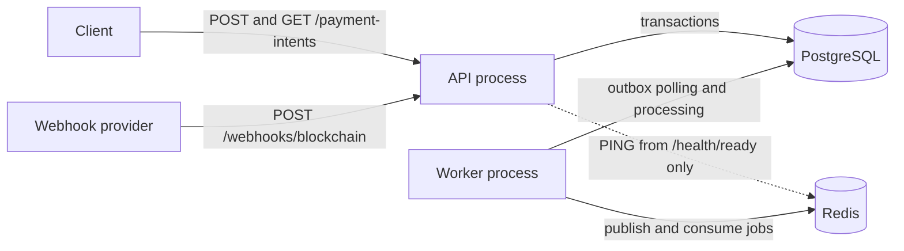
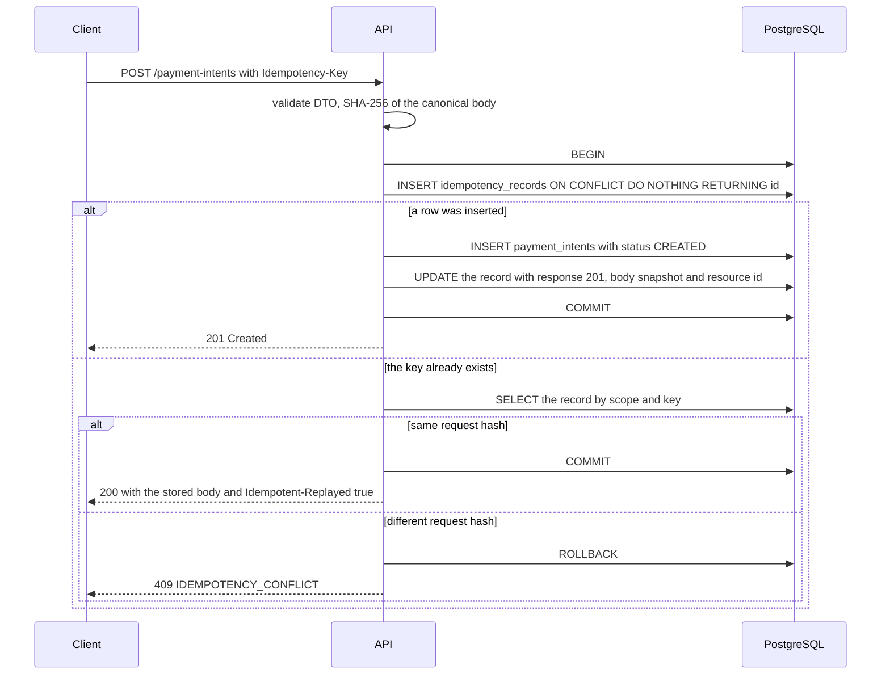
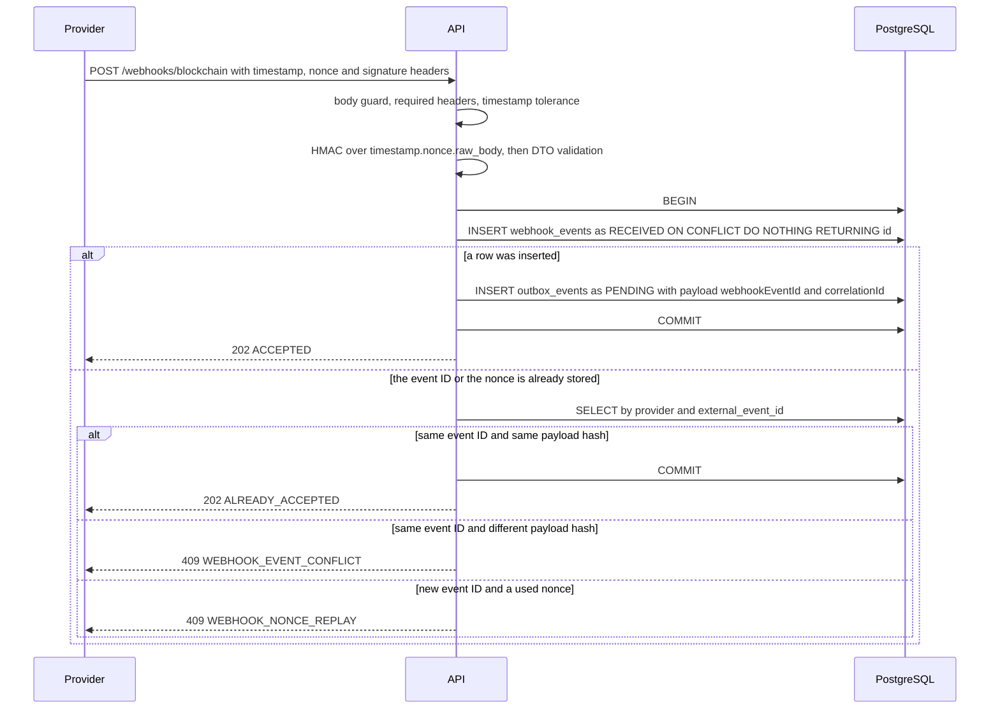
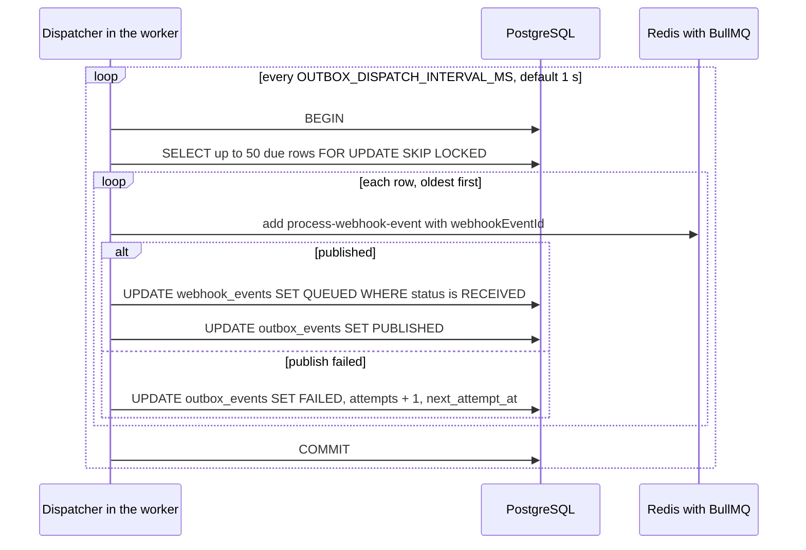
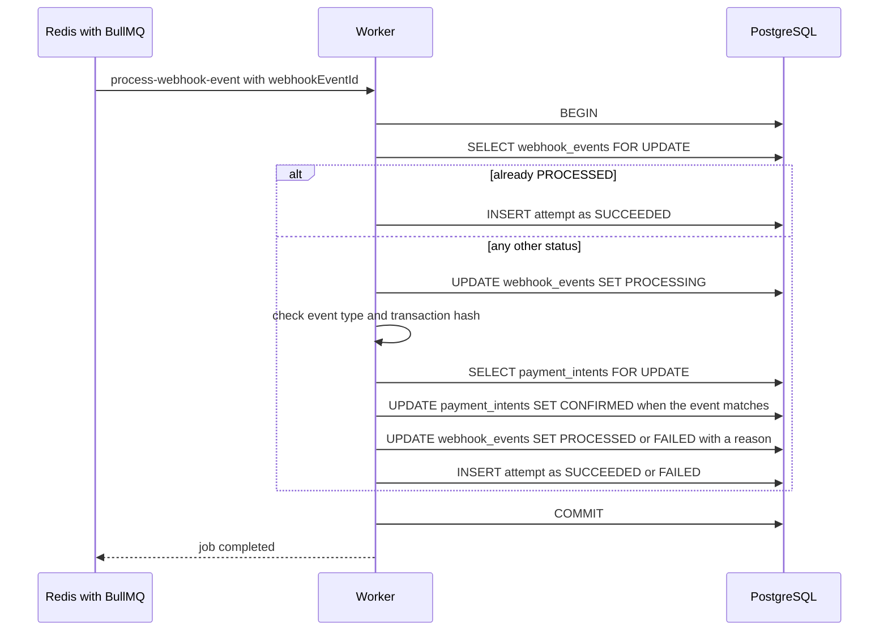

# Architecture

`transaction-event-gateway` is a NestJS service that creates payment intents idempotently and accepts HMAC-signed webhook events that confirm them. An accepted webhook is stored in a PostgreSQL inbox together with a transactional outbox row. A separate worker process publishes the outbox row to BullMQ and applies the event to its payment intent.

The service does not:

- hold funds, private keys, wallets or signing material, and it moves no money;
- integrate with a real blockchain node or payment provider: it accepts one generic provider, `blockchain`, authenticated by a shared HMAC secret;
- authenticate or authorize API callers: idempotency keys are global and there is no tenancy;
- offer a retry endpoint or an admin UI.

Related documents: [API](api.md), [database schema](database.md), [domain state machine](domain-state-machine.md), [failure modes](failure-modes.md), [runbook](runbook.md), [testing](testing.md).

## Topology

```mermaid
flowchart LR
    client[Client] -->|POST and GET /payment-intents| api[API process]
    provider[Webhook provider] -->|POST /webhooks/blockchain| api
    api -->|transactions| pg[(PostgreSQL)]
    api -.->|PING from /health/ready only| redis[(Redis)]
    worker[Worker process] -->|outbox polling and processing| pg
    worker -->|publish and consume jobs| redis
```

| Component | Responsibility |
| --- | --- |
| API process (`src/main.ts`, `AppModule`) | REST endpoints, request validation, webhook verification, durable writes, health endpoints and in-memory rate limiting. Swagger UI is served at `/docs` and the OpenAPI document at `/docs/openapi.json` unless `NODE_ENV=production` and `SWAGGER_ENABLED` is not `true`. The API opens no BullMQ connection; only `/health/ready` touches Redis, through its own client. |
| Worker process (`src/worker.ts`, `WorkerModule`) | A Nest application context without an HTTP server. It runs the outbox dispatcher runner (when `OUTBOX_DISPATCH_ENABLED=true`, the default) and a BullMQ consumer of the `webhook-events` queue with `concurrency: 1`. |
| PostgreSQL | Source of truth for payment intents, idempotency records, the webhook inbox, the outbox and processing attempts. |
| Redis | BullMQ queue data only. No cache, lock or idempotency data is stored in Redis. |

Both processes come from the same codebase and Docker image, and each can run as several replicas: dispatchers skip outbox rows locked by another dispatcher, and workers serialize on row locks (see [Transaction boundaries](#transaction-boundaries)). Rate-limit counters are kept per process. Schema changes are applied by TypeORM migrations in a separate one-shot step (the Compose `migrate` service); the API and worker neither run migrations nor synchronize the schema at startup.

Connection settings that shape failure behavior:

- Each process's application pool opens at most 10 PostgreSQL connections with a 5 s connect timeout. It sets no statement timeout, because a global one would abort worker transactions that wait on row locks.
- Health checks use their own PostgreSQL pool (one connection, 1 s connect timeout, 2 s statement and query timeout) and their own Redis client (1 s connect and command timeout, no offline queue, no reconnect), so a busy application pool does not delay them.
- In the worker, the Redis connection that publishes jobs fails fast: `maxRetriesPerRequest: 1`, a 2 s connect timeout and a 5 s command timeout. A hung Redis therefore fails the publish (the outbox row becomes `FAILED` and is retried) instead of holding the dispatcher's row locks indefinitely. The BullMQ consumer's blocking connection has no command timeout, as BullMQ requires.

## Flows

### Create a payment intent

```mermaid
sequenceDiagram
    participant C as Client
    participant A as API
    participant DB as PostgreSQL
    C->>A: POST /payment-intents with Idempotency-Key
    A->>A: validate DTO, SHA-256 of the canonical body
    A->>DB: BEGIN
    A->>DB: INSERT idempotency_records ON CONFLICT DO NOTHING RETURNING id
    alt a row was inserted
        A->>DB: INSERT payment_intents with status CREATED
        A->>DB: UPDATE the record with response 201, body snapshot and resource id
        A->>DB: COMMIT
        A-->>C: 201 Created
    else the key already exists
        A->>DB: SELECT the record by scope and key
        alt same request hash
            A->>DB: COMMIT
            A-->>C: 200 with the stored body and Idempotent-Replayed true
        else different request hash
            A->>DB: ROLLBACK
            A-->>C: 409 IDEMPOTENCY_CONFLICT
        end
    end
```

A concurrent request with the same key blocks on the insert until the first transaction ends. It then inserts (if the first transaction rolled back) or takes the replay or conflict branch. The request hash covers the canonical JSON of the validated body: keys are sorted recursively and numeric strings are not normalized, so `"125.50"` and `"125.5"` differ. All keys share one scope, `payment-intents:create`.

Clients follow an intent with `GET /payment-intents/{id}`, a single read of the row that returns the same representation as the creation response. A replay returns the stored creation response instead, so it does not show a later confirmation.

### Accept a webhook

```mermaid
sequenceDiagram
    participant P as Provider
    participant A as API
    participant DB as PostgreSQL
    P->>A: POST /webhooks/blockchain with timestamp, nonce and signature headers
    A->>A: body guard, required headers, timestamp tolerance
    A->>A: HMAC over timestamp.nonce.raw_body, then DTO validation
    A->>DB: BEGIN
    A->>DB: INSERT webhook_events as RECEIVED ON CONFLICT DO NOTHING RETURNING id
    alt a row was inserted
        A->>DB: INSERT outbox_events as PENDING with payload webhookEventId and correlationId
        A->>DB: COMMIT
        A-->>P: 202 ACCEPTED
    else the event ID or the nonce is already stored
        A->>DB: SELECT by provider and external_event_id
        alt same event ID and same payload hash
            A->>DB: COMMIT
            A-->>P: 202 ALREADY_ACCEPTED
        else same event ID and different payload hash
            A-->>P: 409 WEBHOOK_EVENT_CONFLICT
        else new event ID and a used nonce
            A-->>P: 409 WEBHOOK_NONCE_REPLAY
        end
    end
```

`ON CONFLICT DO NOTHING` has no conflict target, so it covers both the unique index on `(provider, external_event_id)` and the partial unique index on `(provider, nonce)`. When the insert returns nothing, the API classifies the conflict in the same transaction: first by event ID, then by nonce; if neither lookup finds a row it answers 503 `SERVICE_UNAVAILABLE`. No rejected request is persisted. Rejections from the webhook service (headers, timestamp, signature, DTO, conflicts) are logged as `webhook_rejected` with an error code. The API never publishes to Redis.

### Dispatch the outbox

```mermaid
sequenceDiagram
    participant D as Dispatcher in the worker
    participant DB as PostgreSQL
    participant Q as Redis with BullMQ
    loop every OUTBOX_DISPATCH_INTERVAL_MS, default 1 s
        D->>DB: BEGIN
        D->>DB: SELECT up to 50 due rows FOR UPDATE SKIP LOCKED
        loop each row, oldest first
            D->>Q: add process-webhook-event with webhookEventId
            alt published
                D->>DB: UPDATE webhook_events SET QUEUED WHERE status is RECEIVED
                D->>DB: UPDATE outbox_events SET PUBLISHED
            else publish failed
                D->>DB: UPDATE outbox_events SET FAILED, attempts + 1, next_attempt_at
            end
        end
        D->>DB: COMMIT
    end
```

A row is due when its `dead_at` is null and it is `PENDING`, or `FAILED` with `next_attempt_at` unset or in the past. A failed publish ends the batch: the remaining locked rows would fail the same way, one command timeout each, so they are released for the next run. The webhook update applies only to `RECEIVED` rows, so an event the worker has already processed is never moved back. Retry delays, the poison-payload marker and the other outbox transitions are in [domain-state-machine.md](domain-state-machine.md#outbox-event). The BullMQ `Queue` used for publishing is recreated after an error, and a failed add is retried once on a fresh instance before the row is marked `FAILED`. The runner keeps at most one batch in flight; after a batch that throws (for example, PostgreSQL is unreachable) it pauses for 1 s, doubling up to 30 s.

### Reconcile stale published events

A job can disappear after its outbox row was marked `PUBLISHED`: Redis loses the job (flush, failover without persistence, eviction, manual removal), or the job fails all five BullMQ attempts (for example, PostgreSQL is unavailable for more than about 75 seconds during processing). In both cases the webhook stays `QUEUED` (a failed worker transaction rolls back), and the regular dispatch loop never selects a `PUBLISHED` row again.

Every 60 seconds the dispatcher runner in the worker (only when `OUTBOX_DISPATCH_ENABLED=true`) calls `OutboxDispatcherService.reconcileStalePublishedEvents`. It moves at most 100 outbox rows back to `FAILED` with `next_attempt_at = now()` and `last_error = 'STALE_PUBLISHED_WEBHOOK_REQUEUED'`, leaving `attempts` unchanged. A row qualifies when:

- its type is `process-webhook-event`, its status is `PUBLISHED` and `dead_at` is null;
- it was published more than 10 minutes ago;
- its webhook event is still `RECEIVED` or `QUEUED`.

The change is a single `UPDATE ... FROM` statement with `FOR UPDATE SKIP LOCKED`, so several worker processes can run it safely. The regular dispatch loop (every second by default) then publishes a new job, so recovery happens 10 to 11 minutes after the last publication. Each re-queued row is logged as `outbox_reconcile_requeued` (warn) with its `webhookEventId`, and the worker logs `worker_job_exhausted` (warn) when a job fails its fifth and final attempt. A job that is merely waiting in a backlog for longer than 10 minutes gets one extra job per 10 minutes; this is harmless because processing is idempotent (row lock and `PROCESSED` short-circuit). To re-drive an event without waiting, see [runbook.md](runbook.md#re-drive-a-stuck-webhook-event).

### Process a webhook event

```mermaid
sequenceDiagram
    participant Q as Redis with BullMQ
    participant W as Worker
    participant DB as PostgreSQL
    Q->>W: process-webhook-event with webhookEventId
    W->>DB: BEGIN
    W->>DB: SELECT webhook_events FOR UPDATE
    alt already PROCESSED
        W->>DB: INSERT attempt as SUCCEEDED
    else any other status
        W->>DB: UPDATE webhook_events SET PROCESSING
        W->>W: check event type and transaction hash
        W->>DB: SELECT payment_intents FOR UPDATE
        W->>DB: UPDATE payment_intents SET CONFIRMED when the event matches
        W->>DB: UPDATE webhook_events SET PROCESSED or FAILED with a reason
        W->>DB: INSERT attempt as SUCCEEDED or FAILED
    end
    W->>DB: COMMIT
    W-->>Q: job completed
```

A domain failure (unknown payment intent, amount or asset mismatch, and so on) is a normal result: the webhook becomes `FAILED` with a reason and the job completes. An exception, such as a lost database connection, rolls back the whole transaction, including the attempt row, and fails the BullMQ attempt. Jobs use `attempts: 5` with exponential backoff from 5 s (5, 10, 20 and 40 s between attempts), so the fifth attempt fails about 75 seconds after the first; the webhook is then still `QUEUED` and reconciliation picks it up. Redis keeps completed jobs for up to one hour (at most 1,000) and failed jobs for up to seven days (at most 5,000).

Payment intents are created as `CREATED`, and the worker moves them to `CONFIRMED`. `PROCESSING`, `FAILED` and `EXPIRED` exist in the enum, but no code path writes them. The order of checks and every failure reason are in [domain-state-machine.md](domain-state-machine.md).

## Transaction boundaries

| Operation | One transaction | Notes |
| --- | --- | --- |
| Create a payment intent | Idempotency record, payment intent, response snapshot | A key never exists without its outcome. |
| Accept a webhook | `webhook_events` row and `outbox_events` row | No Redis call, so every accepted event has durable work. |
| Dispatch the outbox | Up to 50 outbox rows locked with `FOR UPDATE SKIP LOCKED`; the webhooks marked `QUEUED` and the outbox rows marked `PUBLISHED` | Jobs are published while the locks are held. Publishing and committing are not atomic: a crash or rollback after a publish leaves the row due, and it is published again. Duplicate jobs are possible and harmless. |
| Process a job | Webhook row lock, then payment intent row lock; state changes; attempt row | Before confirming, the worker also locks the intent that already holds the transaction hash, if there is one. |
| Reconcile | One `UPDATE ... FROM` statement | Skips rows locked by other workers. |

| Race | Protection |
| --- | --- |
| Concurrent requests with one idempotency key | Unique `(scope, idempotency_key)`; the second request replays or gets 409 |
| Concurrent delivery of one webhook | Unique `(provider, external_event_id)` |
| One nonce on two events | Partial unique `(provider, nonce)` |
| Several dispatchers | `FOR UPDATE SKIP LOCKED` |
| Duplicate jobs for one event | Webhook row lock and the `PROCESSED` short-circuit |
| Two events for one payment intent | Payment intent row lock |
| One transaction hash confirming two intents | Locked lookup before confirming, plus the partial unique index on `confirmed_tx_hash`; when two jobs race, the losing job fails, is retried and records `CONFIRMED_TX_HASH_CONFLICT` |
| Commit succeeded, publish failed | Transactional outbox with retries |
| Job lost from Redis or out of attempts | Reconciliation |

## Key decisions

- **PostgreSQL is the source of truth.** Payment state, idempotency decisions, the webhook inbox, the outbox and processing attempts live in PostgreSQL, so correctness does not depend on Redis TTLs, in-memory locks or queue uniqueness. When PostgreSQL is unavailable, durable operations fail instead of falling back to memory or Redis.
- **Redis holds no authoritative state.** Losing queue data delays processing until reconciliation re-queues the affected events; it does not lose accepted webhooks, whose inbox and outbox rows are already committed. While Redis is down, the API keeps accepting payment intents and webhooks.
- **Webhook inbox and transactional outbox.** The inbox row and the outbox row commit together, so a webhook is acknowledged only once its processing work is durable, and a Redis failure cannot open a gap between the database and the queue. Publication is at least once.
- **Jobs carry IDs only.** Job data and the outbox payload are `{ webhookEventId, correlationId }`: the webhook event ID, and the correlation ID of the request that accepted the webhook, which only labels log lines. The worker reloads the event and the payment intent from PostgreSQL under row locks, so a stale or duplicated job cannot apply outdated data.
- **Database constraints are the final guard.** Unique indexes on idempotency keys, provider event IDs, provider nonces and confirmed transaction hashes, plus a positive-amount check, hold even when application checks race.
- **Thin controllers.** Controllers deal with HTTP concerns (headers, status codes, the raw body) and delegate to services, which own transactions and domain rules.
- **Separate liveness, readiness and serving checks.**
  - `GET /health/live`: the process answers; no dependency is checked.
  - `GET /health/ready`: required configuration, PostgreSQL (`SELECT 1`) and Redis (`PING`), each through the dedicated health clients. Meant for operators and deploy gates.
  - `GET /health/serving`: configuration and PostgreSQL only. It is the load balancer health check in the Terraform scaffold, so a Redis incident does not drain API tasks that can still accept payment intents and webhooks.
  - Health endpoints are exempt from rate limiting. The worker has no health endpoint.

## Security

- **Webhook signature.** `X-Webhook-Signature: v1=<hex>` carries an HMAC-SHA256, keyed with `WEBHOOK_SECRET`, over `timestamp.nonce.raw_body`, where `raw_body` is the exact request bytes. Digests are compared with `crypto.timingSafeEqual`. A missing or malformed header gets 400; a wrong signature gets 401 `INVALID_WEBHOOK_SIGNATURE`.
- **Replay protection.** `X-Webhook-Timestamp` (Unix seconds) must be within `WEBHOOK_TIMESTAMP_TOLERANCE_SECONDS` (default 300 s) of the server clock in either direction, otherwise the request gets 400 `STALE_WEBHOOK_TIMESTAMP`. The nonce is part of the signed input. Nonces and event IDs are unique per provider through PostgreSQL constraints, not a cache.
- **Order of checks.** Body parser, body guard, rate limit, headers, timestamp, signature, DTO, then the database. An unsigned or stale request never reaches PostgreSQL and cannot use up a nonce or an event ID.
- **Body size.** The JSON body parser accepts at most 256 KB; larger bodies get 413 `PAYLOAD_TOO_LARGE`.
- **Request body guard.** An Express middleware registered after the JSON and urlencoded body parsers rejects, with 400 `VALIDATION_ERROR`, any request body nested deeper than 32 levels, any string or key containing a C0 control character other than tab, LF and CR (including NUL), any lone UTF-16 surrogate, and the keys `__proto__`, `constructor`, `prototype` or other `Object.prototype` member names at any depth. On the webhook route it runs before signature verification. PostgreSQL data exceptions (SQLSTATE class 22) that still reach the exception filter map to 400 `VALIDATION_ERROR` and are logged as a warning with the SQLSTATE.
- **DTO validation.** Unknown DTO properties are rejected (`forbidNonWhitelisted`), not silently dropped; `metadata` on payment intents is a free-form JSON object.
- **Error responses.** Every error, including an unknown route (404 `NOT_FOUND`), the rate limit (429 `RATE_LIMITED`) and body parser failures, uses the `error`, `message` and `correlationId` envelope. Unexpected errors return a generic 500 body, and malformed JSON or an undecodable compressed body a generic 400; stack traces, framework and parser messages, and database messages are not returned.
- **Never logged.** Secrets, signatures, raw or parsed request bodies, idempotency keys, nonces and raw error messages. The logger drops every field outside its allow-list (see [Observability](#observability)).
- **Configuration.** Environment variables are validated at startup; `WEBHOOK_SECRET` must be at least 16 characters, and validation errors do not echo the database or Redis URL.
- **Rate limiting.** `@nestjs/throttler` with in-memory storage: by default 100 requests per 60 s per route and client IP. Counters are per process, and `X-Forwarded-For` is not used.

## Observability

- **Log format.** `src/common/logging/structured-logger.ts` builds each application event as an object with an `event` name and allow-listed fields, and the application logger (`src/common/logging/app-logger.ts`) prints it in one of two formats, chosen by `LOG_FORMAT`:
  - `json`, the default when `NODE_ENV=production` and the setting in Docker Compose and the ECS task definitions: one JSON object per line with `timestamp` (ISO 8601 UTC), `level` (`info`, `warn`, `error`, ...), `context` (the logger name) and the event fields at the top level, for example `{"timestamp":"2026-09-23T10:00:00.000Z","level":"info","context":"WebhookEventsService","event":"webhook_accepted",...}`. Messages from Nest itself, such as startup and route mapping, keep their text under `message`. There are no ANSI color codes.
  - `text`, the default otherwise, for example under `npm run start:dev`: Nest's console format, with the `[Nest]` prefix, the process ID, a local timestamp, the level, the context and ANSI colors unless `NO_COLOR` is set, followed by the event as compact JSON.
- **Allow-listed fields.** `correlationId`, `requestId`, `paymentIntentId`, `webhookEventId`, `externalEventId`, `provider`, `jobId`, `status`, `errorCode`, `method`, `path`, `durationMs`, `suppressedCount`, and the diagnostics fields `errorName`, `causeCode` and `stackTop`. Other fields are dropped. String values are limited to printable ASCII and 500 characters. `errorCode` is a stable code such as `IDEMPOTENCY_CONFLICT`, never a free-form message.
- **5xx diagnostics.** 5xx responses and worker and dispatcher failures log `errorName`, `causeCode` (the error code, SQLSTATE or errno when it matches a safe pattern) and `stackTop` (the first three stack frames, without the error message). Raw error messages are never logged, because PostgreSQL messages can contain field values.
- **Correlation IDs.** The API accepts `X-Correlation-ID` (1 to 255 visible ASCII characters) or generates a UUID, returns it in the response header and in error bodies, and keeps it in `AsyncLocalStorage` for the duration of the request (`src/common/request-context/`). Log lines written while the request is handled, such as `payment_intent_created` or `webhook_accepted`, carry `correlationId` and a per-request `requestId`. For a webhook, the ID is also stored in the outbox payload and copied into the BullMQ job; the dispatcher publishes the row and the worker processes the job under that correlation ID, with a new `requestId`, so their log lines carry it. Rows and jobs written before the ID was stored carry none and are processed without it.
- **Following a webhook.** The API's `webhook_accepted` (or `webhook_replayed`) line carries `externalEventId`, `webhookEventId` and the request's `correlationId`. `outbox_dispatch_published`, `worker_job_processed`, `worker_job_failed`, `worker_job_exhausted` and `outbox_reconcile_requeued` carry the same `webhookEventId` and `correlationId`, so one filter on the correlation ID over the API and worker logs shows the whole path.
- **Repeated errors.** During a Redis outage the worker logs identical connection errors once per 30 s per error code, with a `suppressedCount`, and logs a recovery line when Redis is back.
- **Metrics.** No metrics are exported.

## Known limitations

Limitations of the current implementation, and how they show up in operation, are listed in [Failure modes: known limitations](failure-modes.md#known-limitations).

Not implemented:

- authentication, authorization and per-tenant idempotency scopes;
- a retry endpoint or an admin UI;
- payment intent expiration, or any transition to `FAILED` or `EXPIRED`;
- metrics, tracing and alerting;
- retention or cleanup of the durable tables (`idempotency_records.expires_at` is set 30 days ahead, but nothing deletes rows);
- webhook secret rotation (one active secret);
- other providers, and processing of event types other than `transaction.confirmed`;
- proxy-aware or shared rate limiting.
