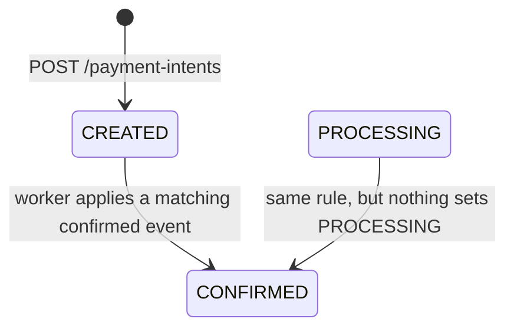
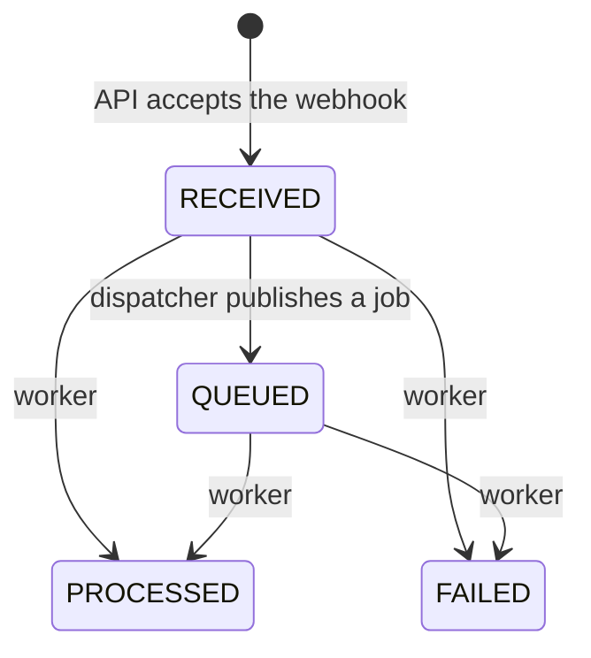
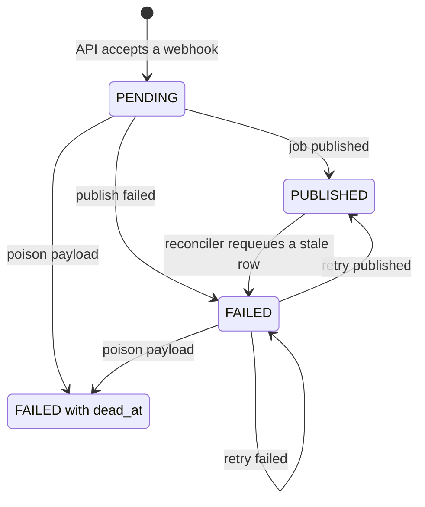

# Domain State Machine

This document lists the statuses of the durable records, who writes each status and when. The statuses are PostgreSQL enum types (`payment_intent_status`, `webhook_event_status`, `outbox_event_status`); the processing attempt status is a `varchar` with a check constraint. Columns and constraints are described in [database.md](database.md), and the flows that drive the transitions in [architecture.md](architecture.md).

Every transition is written in a PostgreSQL transaction. BullMQ jobs carry only a `webhookEventId` and a correlation ID for logging; no status lives in Redis.

## Payment intent

| Status | Written by |
| --- | --- |
| `CREATED` | API, when `POST /payment-intents` creates the intent (`PaymentIntentsService`) |
| `CONFIRMED` | Worker, when it applies a matching `transaction.confirmed` webhook (`WebhookEventProcessorService`) |
| `PROCESSING`, `FAILED`, `EXPIRED` | Nothing. The values exist in the enum, but no code path writes them. |

Confirmation sets `confirmed_tx_hash` and clears `failure_reason`. `expires_at` stays null because there is no expiration process. The worker also handles the unused values if a row has them, for example after a manual update: it confirms a `PROCESSING` intent like a `CREATED` one, and it never changes a `CONFIRMED`, `FAILED` or `EXPIRED` intent. No transition leaves `CONFIRMED`, and confirming an intent writes no outbox event.

## Webhook event

| Status | Written by | Meaning |
| --- | --- | --- |
| `RECEIVED` | API, in the transaction that also inserts the outbox row | A signed, valid webhook was accepted. |
| `QUEUED` | Dispatcher, in the transaction that marks the outbox row `PUBLISHED`; only a `RECEIVED` row is updated | A job was published. |
| `PROCESSING` | Worker, inside its transaction | Replaced by `PROCESSED` or `FAILED` before the transaction commits, so no committed row has this status. |
| `PROCESSED` | Worker | The event was applied, or the intent was already confirmed with the same transaction hash. |
| `FAILED` | Worker | A processing rule rejected the event; `failure_reason` holds the reason. |
| `REJECTED` | Nothing | The value exists in the enum. Rejected requests are not persisted at all. |

- The worker processes an event in any status other than `PROCESSED` and `FAILED`. It usually finds `QUEUED`. It finds `RECEIVED` when it locks the row before the dispatcher's transaction marks it `QUEUED`; once the worker has committed, the dispatcher's conditional update changes nothing.
- `PROCESSED` and `FAILED` are final. A later job for the event, for example one published again after a dispatcher transaction rolled back, records an attempt with the stored outcome (`SUCCEEDED`, or `FAILED` with the stored reason) and changes nothing else, even if the payment intent has changed since.
- Nothing re-queues a `FAILED` event: reconciliation only looks at `RECEIVED` and `QUEUED` events, and there is no retry endpoint. When the cause of a failure is gone, for example the payment intent that the webhook named has been created since, an operator re-drives the event with SQL (see the [runbook](runbook.md#re-drive-a-failed-webhook-event)).
- An exception inside the worker transaction restores the previous status. After five failed attempts the event therefore keeps its previous status, normally `QUEUED`, and a `QUEUED` event waits until reconciliation re-queues its outbox row (see [Outbox event](#outbox-event)).
- `processed_at` is set when the worker commits `PROCESSED` or `FAILED`.

### Processing rules

The worker runs these steps in one transaction and stops at the first one that decides the outcome. Every failure marks the webhook `FAILED` with the reason and leaves the payment intent unchanged.

1. Lock the webhook row (`SELECT ... FOR UPDATE`). If the row does not exist, the worker throws `WEBHOOK_EVENT_NOT_FOUND`; the exception fails the job attempt and BullMQ retries it.
2. The event is `PROCESSED`: record a `SUCCEEDED` attempt and return `already_processed`. The event is `FAILED`: record a `FAILED` attempt with the stored `failure_reason` and return `already_failed`.
3. Set `PROCESSING` and clear `failure_reason` and `processed_at`.
4. `payload.type` is not `transaction.confirmed`: `UNSUPPORTED_EVENT_TYPE`.
5. `payload.txHash` is not a non-empty string: `MISSING_TX_HASH`. From here on the hash is used in canonical form: trimmed, and lowercased when it is `0x`-prefixed hexadecimal. The API stores it that way; the worker normalizes again for events stored before it did.
6. Lock the payment intent named by `payment_intent_id`. If none exists: `UNKNOWN_PAYMENT_INTENT`. Payment intents are never created from webhooks.
7. The amounts differ when compared as decimals with 18 fractional digits (`"125.5"` matches a stored `125.50`): `AMOUNT_MISMATCH`. The assets differ: `ASSET_MISMATCH`. Only amount and asset are compared; the signed webhook carries no `reference` or `destination`, so the confirmation trusts the provider on where the funds went.
8. The intent is `CONFIRMED`: with the same `confirmed_tx_hash`, mark the webhook `PROCESSED` without changing the intent; with another hash, `PAYMENT_INTENT_TERMINAL`.
9. The intent is `FAILED` or `EXPIRED`: `PAYMENT_INTENT_TERMINAL`.
10. Lock the intent that already holds this transaction hash, if any. If it is a different intent: `CONFIRMED_TX_HASH_CONFLICT`.
11. Set the intent to `CONFIRMED` with `confirmed_tx_hash`, mark the webhook `PROCESSED` and record a `SUCCEEDED` attempt.

These seven reasons are the complete set (`ProcessingFailureReason` in `src/processing/webhook-event-processor.service.ts`). If two workers confirm different intents with the same transaction hash at the same time, the partial unique index on `confirmed_tx_hash` rejects the second update; that job attempt fails, and its retry records `CONFIRMED_TX_HASH_CONFLICT`.

### Job outcomes

| Result | Webhook | Payment intent | Attempt row | BullMQ job |
| --- | --- | --- | --- | --- |
| `already_processed` | Unchanged | Unchanged | `SUCCEEDED` | Completes; logged as `worker_job_processed` |
| `already_failed` | Unchanged | Unchanged | `FAILED`, stored reason in `error_message` | Completes; logged as `worker_job_processed` with status `ALREADY_FAILED` and the reason as `errorCode` |
| `processed` | `PROCESSED` | `CONFIRMED`, unless it already was with the same hash | `SUCCEEDED` | Completes; logged as `worker_job_processed` |
| `failed` with a reason | `FAILED` with the reason | Unchanged | `FAILED`, reason in `error_message` | Completes; logged as `worker_job_failed` (warn) with the reason as `errorCode` |
| Exception | Previous status (rollback) | Unchanged (rollback) | None (rollback) | The attempt fails and BullMQ retries it, up to 5 attempts. Failed attempts are logged as `worker_job_failed`, and the fifth, final failure as `worker_job_exhausted`. |

A domain failure is a durable result, so BullMQ does not retry it.

## Outbox event

Outbox rows exist only for webhook processing: `type = process-webhook-event`, `aggregate_type = webhook_event`, `aggregate_id` is the webhook event ID, and `payload` is `{ webhookEventId, correlationId }`, where `correlationId` is the correlation ID of the request that accepted the webhook; rows written before it was added have only `webhookEventId`.

| Status | `dead_at` | Meaning |
| --- | --- | --- |
| `PENDING` | null | Stored with the webhook, not published yet. |
| `PUBLISHED` | null | A job was published; `published_at` records when. |
| `FAILED` | null | Waiting for a retry at `next_attempt_at`. |
| `FAILED` | set | Poison payload; never selected again. |

A row is due for dispatch when `dead_at` is null and it is `PENDING`, or `FAILED` with `next_attempt_at` null or in the past. The dispatcher takes due rows oldest first, at most 50 per batch, with `FOR UPDATE SKIP LOCKED` (see [architecture.md](architecture.md#dispatch-the-outbox)).

| Transition | Actor and trigger | Column changes |
| --- | --- | --- |
| none to `PENDING` | API accepts a webhook, in the same transaction as the inbox row | `attempts = 0` |
| `PENDING` or due `FAILED` to `PUBLISHED` | Dispatcher published the job; the same transaction marks the webhook `QUEUED` | `published_at` set to now; `next_attempt_at` and `last_error` cleared; `attempts` unchanged |
| `PENDING` or due `FAILED` to `FAILED` | Dispatcher: transient publish failure (Redis, BullMQ or the publisher) | `attempts` + 1; `next_attempt_at` = now + min(5 s * 2^(attempts - 1), 5 min), using the new `attempts`; `last_error` = sanitized error message; `dead_at` null |
| `PENDING` or due `FAILED` to `FAILED` with `dead_at` | Dispatcher: deterministic poison payload, `webhookEventId` missing or not a string | `attempts` + 1; `next_attempt_at` null; `last_error = INVALID_OUTBOX_PAYLOAD`; `dead_at` set to now |
| `PUBLISHED` to `FAILED` | Reconciler, every 60 s: published more than 10 minutes ago and the webhook is still `RECEIVED` or `QUEUED` | `next_attempt_at = now()`; `last_error = STALE_PUBLISHED_WEBHOOK_REQUEUED`; `attempts` unchanged; `dead_at` stays null |

- Transient failures are retried indefinitely, with delays of 5, 10, 20, 40, 80 and 160 s and then 5 minutes. `attempts` only counts failed publishes.
- A dead row is not retried until an operator repairs its payload and clears `dead_at`. A missing or malformed `correlationId` never makes a row dead; the job is published without it.
- The reconciler handles at most 100 rows per run. Its details, including why a job can be lost after `PUBLISHED`, are in [architecture.md](architecture.md#reconcile-stale-published-events).
- Publishing and committing are not atomic, so one outbox row can produce more than one job. The worker rules above make duplicates harmless.

## Processing attempts

`webhook_processing_attempts` records worker decisions for operators; correctness never depends on it. Rows are inserted inside the worker transaction:

- `SUCCEEDED` for `processed` and `already_processed`, with `error_message` null;
- `FAILED` for a domain failure and for a later job of a `FAILED` event, with the reason in `error_message`.

`job_id` holds the BullMQ job ID. `STARTED` is allowed by the check constraint but never written. An attempt that throws leaves no row, because the insert rolls back with the rest of the transaction; such failures are visible only in the worker log and in BullMQ.

## Requests that change no state

| Request | Response | Rows written |
| --- | --- | --- |
| Webhook rejected before the database: body size, body guard, headers, timestamp, signature or DTO | 400, 401 or 413 | None |
| Webhook with a known event ID and the same payload | 202 `ALREADY_ACCEPTED` | None |
| Webhook with a known event ID and a different payload | 409 `WEBHOOK_EVENT_CONFLICT` | None |
| Webhook with a new event ID and a used nonce | 409 `WEBHOOK_NONCE_REPLAY` | None |
| Payment intent request with a missing `Idempotency-Key` or an invalid or oversized body | 400 or 413 | None |
| Payment intent request with a known key and the same body | 200 with `Idempotent-Replayed: true` | None |
| Payment intent request with a known key and a different body | 409 `IDEMPOTENCY_CONFLICT` | None |
| `GET /payment-intents/{id}` | 200, 400 for an ID that is not a UUID, or 404 | None |
| Any request over the rate limit | 429 `RATE_LIMITED` | None |
